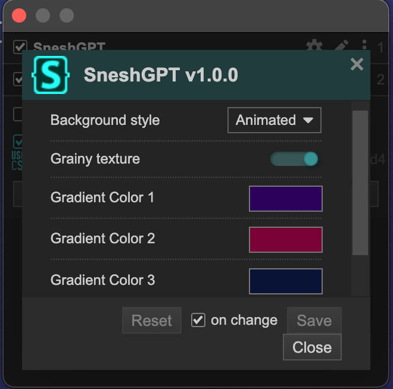

# SneshGPT 

This is the second in a - hopefully short - series of ""design"" projects. 

## Visuals 

This ChatGPT interface is prettier and comes with your own customized quick reply options. You can customize them by changing the first lines in the [SneshGPT_quickreplies.user.js](https://github.com/senshastic/sensha-betterer-todoist/raw/refs/heads/main/js/SneshGPT_quickreplies.user.js) file.
These replies can be different based on whether or not ChatGPT sent you code. You can also continue writing in the bar after it was pre-filled with one of your automated answers, so you can explain your problem in more details. 

It also has a pretty acrylic automatically sliding sidebar, which is neat. 

If you do not like the gradient or if you are like me and you like changing colors all the time, you can change the colors directly through Stylus' UI. It's pretty neat and instantaneous. I also added a toggle for the grainy texture and the background now comes with three options: 
- Animated gradient (default)
- Static gradient
- No gradient
  

### Installation 

You should use the Dark Theme in ChatGPT - so all the letters go white and not black. 

Install the css using Stylus

-   [Firefox](https://addons.mozilla.org/en-US/firefox/addon/styl-us/)
-   [Chrome](https://chromewebstore.google.com/detail/stylus/clngdbkpkpeebahjckkjfobafhncgmne)

Once you have Stylus, you can install it directly clicking here: 

Install le JS scripts using whatever people use to manage userscripts. I used [ViolentMonkey](https://violentmonkey.github.io/) because that's what Fallen used. Can be done directly once you have the userscript manager installed by clicking here: 

- Quickreplies: 

- Sidebar:

I recommend installing at least quickreplies, but the css version works fine without any of the above scripts.

### Fonts & Styles

I made an add-on that lets you change some of the fonts and colors of the interface. You can find the add-on here: 

The add-on uses fonts from the Monaspace project and requires you to install them on your computer. They are pretty cool and use fancy words like *Texture Healing*, you should get them. 

If you don't have them, only the colors of the code blocks will change, which is already pretty nice imo. 

It also uses the following font if installed on your computer: 

- CC Wild Words

### Credits 

- [Fallen](https://github.com/FallenStar08) - I do be loving - doing things - with you. 
- Nins - Even though you saw no difference between grainy and not grainy, which is wild. 

 
